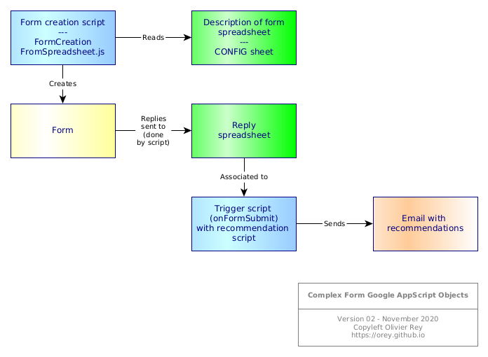
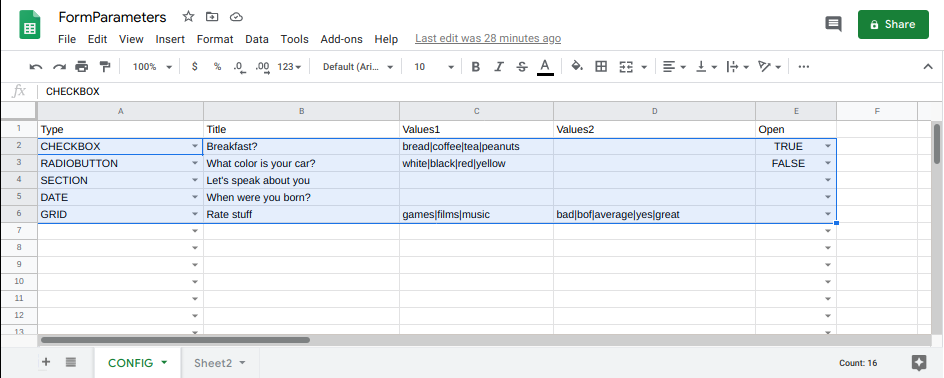

# Complex Recommendation Google Form

## Problem statement

### Problem #1: Automate the creation of a Form from a Spreadsheet

Google Forms are painful to do when the questionnaire is big. this project proposes a way to create a Google Form from a Google spreadsheet.

### Problem #2: Treat automatically the responses with complex business rules at the end of the questionnaire

A trigger is added when the response spreadsheet is filled. This trigger calculates the recommendation and sends an email to the one that filled the questionnaire.

## Overview

The following schema explains the various Google Workspace objects that are required to create this complex form.

The specifications were the following:

* As the form is complex, its description is in a specific spreadsheet. This enables the form to be recreated on demand with new questions without entering into the standard form edition process.
* The form is parameterized to output its data in a spreadsheet.
* A trigger is attached to the spreadsheet (`onFormSubmit`). This trigger is also associated to a manifest requiring some authorizations.
* This trigger calls the recommendation engine by passing `e.namedValues` to the script with the recommendation algorithm. This script sends an email to the user with the result of the processing.

## Spredsheet to parameterize the form

In order to work, the script makes the assumptions that the configuration spreadsheet has 5 columns, and that the data start in line 2. In the header of the script, you will be able to provide your document IDs (currently, the document IDs are mine but they are declared as constants in the beginning of the script file.

